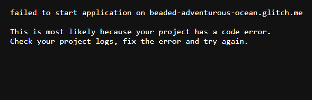
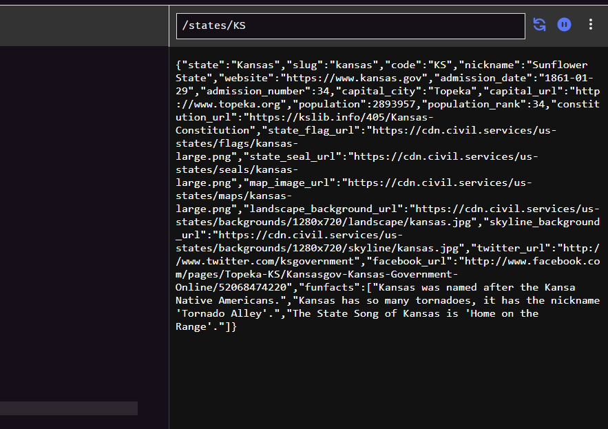
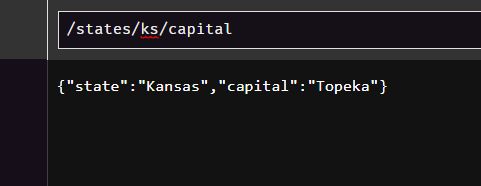
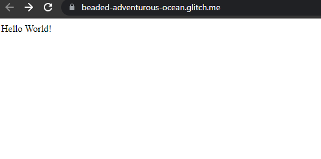
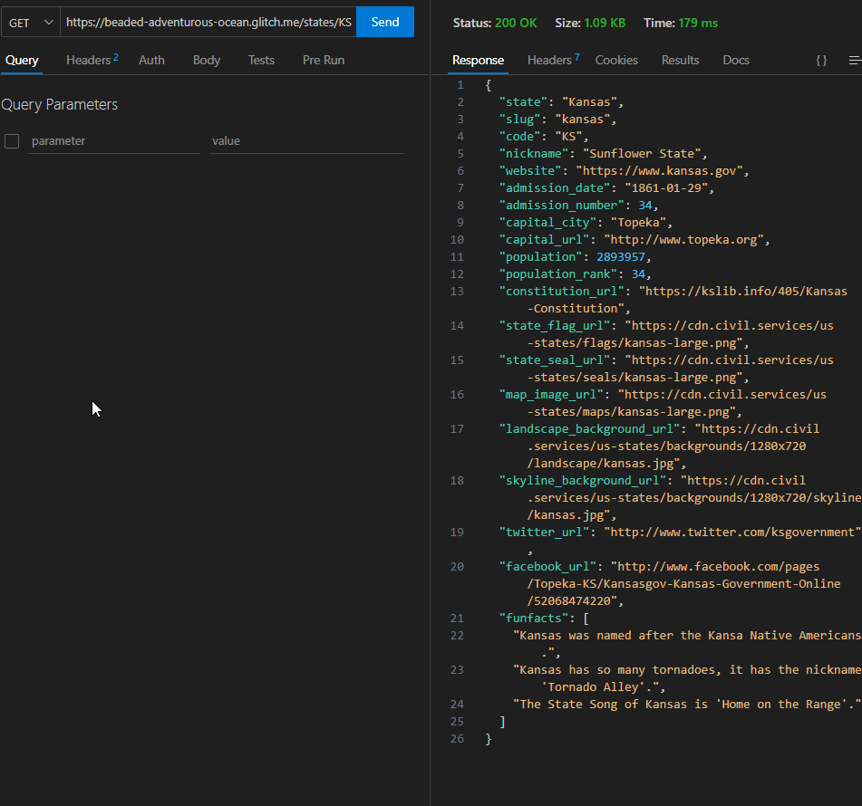

# INF653 Final Project

# REST API for US States Data

This project is a REST API built with Node.js, Express, and MongoDB. It provides a variety of endpoints to retrieve and serves information about US states and some fun facts. As well as allowing users to add, update, and delete fun facts for a state.

## Features:
- Get all state data
- Get specific state data
- Get fun facts for a specific state
- Add, update, and delete fun facts for a state
- Filter options for getting state data

## Dependencies:
- Node.js
- Express
- MongoDB
- Mongoose
- Nodemon

## Installation:
- Clone the repo
- Run `npm install` to install dependencies
- node `node server.js` to start the server
-

## Usage - API Endpoints:
(Replace :state with the state code, e.g. /states/CA)
- GET /states - Get all states and data
- GET /states/:state - Get specific state data
- GET /states/?contig=true - Get all states in the contiguous US
- GET /states/?contig=false - Get all states not in the contiguous US (Alaska and Hawaii)
- GET /states/:state/funfact - Get fun facts for a state | Currently not working
- GET /states/:state/capital - Get the capital of a state
- GET /states/:state/nickname - Get the nickname of a state
- GET /states/:state/population - Get the population of a state
- GET /states/:state/admission - Get the date of admission to the Union for a state

- POST /states/:state/funfact - Add a fun fact for a state
- PATCH /states/:state/funfact - Update a fun fact for a state
- DELETE /states/:state/funfact - Delete a fun fact for a state

Extra:
(Replace <> with a numerical value, and for ?codes=<>,<>,... replace <> with state codes)
- GET /states?minpop=<>&maxpop=<> - Get all states with a population between minpop and maxpop
- GET /states?minpop=<> - Get all states with a population greater than minpop
- GET /states?maxpop=<> - Get all states with a population less than maxpop
- GET /states?codes=<>,<>,... - Get all states with the given state codes

Checklist
- [x] Build a REST API for US States data using Node.js, Express, and MongoDB
- [x] Create basic Express server
- [x] Create MongoDB Atlas cluster and connect
- [x] Create MongoDB database and collection
- [x] Build Mongoose schema and model
- [x] Create GET endpoints for all states and specific states
- [x] Create GET endpoints for capital, nickname, population, and admission
- [ ] Create GET endpoint for fun facts - broken
- [x] Create POST, PATCH, and DELETE endpoints for fun facts
- [x] Create extra filter endpoints
- [x] Root URLs follow pattern requirements and serves warnings for invalid URLs
- [ ] Middleware routes for invalid URLs
- [x] Added fun facts to some states
- [x] Test all API endpoints with Postman
- [x] Deploy project to Glitch.com

https://beaded-adventurous-ocean.glitch.me/

<table>
  <tr>
    <td></td>
    <td></td>
  </tr>
  <tr>
    <td></td>
    <td></td>
  </tr>
</table>

